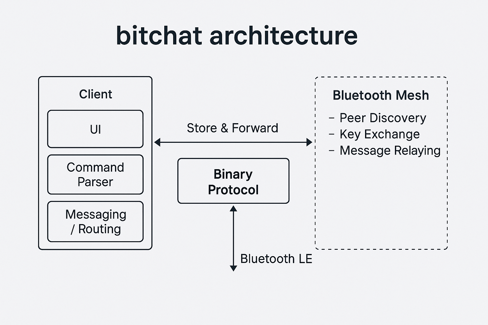

# bitchat: Technical Whitepaper

## 🔒 Overview

**bitchat** is a decentralized, peer-to-peer messaging application designed to function without the internet, servers, or user accounts. It uses Bluetooth Low Energy (BLE) mesh networking and robust cryptographic protocols to enable secure, private, and resilient communication.

---

## 📡 Mesh Networking Design

### Architecture
- Every device acts as both a **client** and a **peripheral**, participating in a **BLE mesh network**.
- Messages can be relayed across multiple devices to reach distant peers (multi-hop).
- Implements **store-and-forward**: messages are cached if the destination peer is temporarily offline and delivered once reconnected.

### Message Routing
- Uses a **Time-To-Live (TTL)** system to limit the number of hops per message (default: 7).
- Messages are uniquely identified and deduplicated using **Bloom filters** and message IDs.

---

## 📊 Architecture Diagram

The following diagram shows how `bitchat` components interact to enable peer-to-peer messaging over Bluetooth:

---

## 📦 Binary Protocol

### Format
- Each packet includes:
  - 1-byte message type
  - Sender public key fingerprint
  - Payload (encrypted/compressed)
  - TTL value
  - Message ID

### Fragmentation
- Messages exceeding BLE MTU size are automatically fragmented and reassembled on receipt.

---

## 🔐 Cryptography

### Private Messaging
- **X25519 key exchange** for shared secret generation.
- **AES-256-GCM** for authenticated encryption.

### Channel Messaging
- **Argon2id** for deriving encryption keys from passwords.
- **AES-256-GCM** for group message encryption.

### Authenticity
- Messages are **digitally signed** using **Ed25519** to verify sender identity.
- Signatures are verified for all received messages (if applicable).

### Forward Secrecy
- Ephemeral key pairs are generated **per session** to ensure forward secrecy.

---

## 🕵️‍♀️ Privacy Features

- No user accounts or phone numbers.
- All messages are ephemeral by default (stored in memory only).
- **Cover traffic**: introduces dummy messages and variable message delays to obscure metadata.
- **Emergency Wipe**: triple-tap app logo to securely erase all in-memory and cached data instantly.

---

## ⚡ Performance & Efficiency

### Compression
- Messages >100 bytes are compressed using **LZ4**.
- Smart compression: skips binary-encoded or already compressed payloads.

### Battery Modes
- **Performance**: Full power when charging or high battery
- **Balanced**: Normal BLE activity
- **Power Saver**: Reduced scanning
- **Ultra-low**: Minimal BLE activity for emergencies

---

## 🧪 Security Assumptions & Limitations

- Relies on Bluetooth LE pairing proximity for peer discovery — not suitable for long-range communication.
- Encryption assumes devices are uncompromised and keys are securely generated/stored in memory.
- No formal external audit of cryptographic implementation yet — contributors welcome.

---

## 🚧 Future Enhancements

- Android client compatibility
- Optional persistent encrypted message logs
- Onion routing for message anonymity
- Custom relay protocol for long-distance bridge nodes
- QR-code based out-of-band key exchange

---

## 📄 License

**Public Domain** – See [LICENSE](LICENSE)

---

*Built with privacy-first principles and designed for resilience in real-world, low-connectivity scenarios.*
