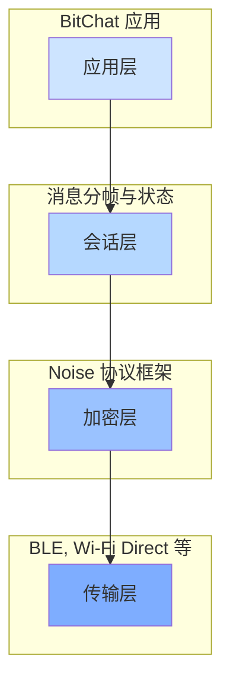
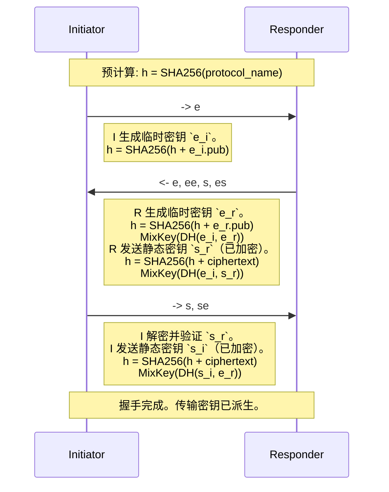
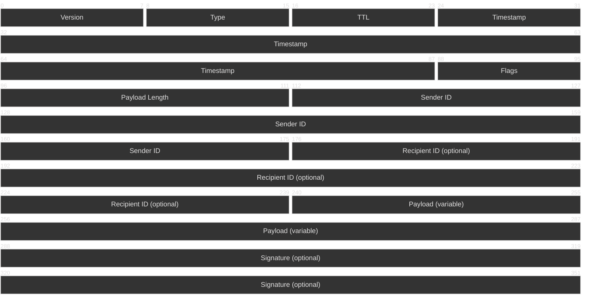

# BitChat 协议白皮书

**版本 1.1**

**日期：2025年7月25日**

---

## 摘要

BitChat 是一款去中心化的点对点 (P2P) 即时通讯应用，旨在通过临时、自组织的协议网络实现安全、私密且具备抗审查能力的通信。本白皮书详细介绍了 BitChat 协议栈，这是一种将现代加密基础与灵活应用协议相结合的分层架构。在核心层，BitChat 利用 Noise 协议框架（特别是 `XX` 模式）在对等节点之间建立相互验证、端到端加密的会话。本文提供了身份管理、会话生命周期、消息分帧以及支撑 BitChat 网络安全考量的技术规范。

---

## 1. 引言

在中心化通信平台盛行的时代，BitChat 通过不依赖中心化服务器的运行方式，提供了一种极具韧性的替代方案。它专为互联网连接不可用或不可信的场景设计，例如抗议活动、自然灾害或偏远地区。通信通过蓝牙低功耗 (BLE) 等传输介质直接在设备之间进行。

BitChat 协议的设计目标是：

*   **机密性：** 所有通信对于第三方必须是不可读的。
*   **身份验证：** 用户必须能够验证通信对象的身份。
*   **完整性：** 消息在传输过程中不能被篡改。
*   **前向安全性：** 长期身份密钥的泄露不得影响过去会话密钥的安全性。
*   **可否认性：** 在密码学上应难以证明特定用户发送了特定消息。
*   **韧性：** 协议必须在丢包严重、低带宽的环境中可靠运行。

本文规定了旨在实现这些目标的技术细节。

---

## 2. 协议栈

BitChat 协议是一个四层栈。这种分层方法实现了关注点分离，从而保证了模块化和未来的可扩展性。

*   **应用层：** 定义面向用户的消息结构 (`BitchatMessage`)、确认信息 (`DeliveryAck`) 以及其他应用级数据。
*   **会话层：** 管理整体通信数据包 (`BitchatPacket`)。这包括路由信息 (TTL)、消息类型、分段以及序列化为紧凑的二进制格式。
*   **加密层：** 使用 Noise 协议框架建立并管理安全通道。它负责加密握手、会话管理以及传输消息的加密/解密。
*   **传输层：** 用于数据传输的基础物理媒介，如蓝牙低功耗 (BLE)。该层已从核心协议中抽象出来。

---

## 3. 身份与密钥管理

BitChat 中的节点身份由两个持久的加密密钥对定义，这些密钥在首次启动时生成并安全地存储在设备的钥匙串 (Keychain) 中。

1.  **Noise 静态密钥对 (`Curve25519`)：** 这是用于 Noise 协议握手的长期身份密钥。该密钥的公钥部分与对等节点共享，以建立安全会话。
2.  **签名密钥对 (`Ed25519`)：** 该密钥用于签署公告和其他需要不可否认性的协议消息，例如将公钥绑定到昵称。

### 3.1. 指纹

用户唯一且可验证的指纹是其 **Noise 静态公钥** 的 **SHA-256 哈希值**。这提供了一种用户友好且安全的方式进行带外 (OOB) 身份验证（例如，通过朗读或扫描二维码）。

`Fingerprint = SHA256(StaticPublicKey_Curve25519)`

### 3.2. 身份管理

`SecureIdentityStateManager` 类负责管理所有加密身份材料和社交元数据（别名、信任级别等）。它出于性能考虑使用内存缓存，并在使用独立的 AES-GCM 密钥加密后将此缓存持久化到钥匙串中。

---

## 4. 社交信任层

除了密码学身份，BitChat 还整合了一个社交信任层，允许用户管理与对等节点的关系。此功能由 `SecureIdentityStateManager` 处理。

### 4.1. 节点验证

虽然 Noise 握手在密码学上验证了节点的密钥，但它无法确认持有该设备的人的真实身份。为了解决这个问题，用户可以通过比对指纹进行带外 (OOB) 验证。一旦用户确认节点的指纹与预期相符，即可将该节点标记为“已验证”。此状态存储在本地并显示在 UI 中，为未来的对话提供强有力的身份保证。

### 4.2. 收藏与屏蔽

为了提升用户体验并提供交互控制，协议支持：
*   **收藏：** 用户可以将信任或频繁联系的节点标记为“收藏”。这是一个本地标记，应用程序可以利用它来优先处理通知或更显著地显示这些节点。
*   **屏蔽：** 用户可以屏蔽节点。当一个节点被屏蔽时，应用程序将在尽可能早的阶段丢弃来自该节点指纹的任何传入数据包，从而在不通知被屏蔽节点的情况下使其“静音”。

---

## 5. Noise 协议层

BitChat 实现了 Noise 协议框架，以提供强大的、经过身份验证的端到端加密。

### 5.1. 协议名称

具体实现的 Noise 协议为：

**`Noise_XX_25519_ChaChaPoly_SHA256`**

*   **`XX` 模式：** 这种握手模式提供相互验证和前向安全性。它不需要任何一方在握手开始前知道对方的静态公钥。密钥在三步握手过程中进行交换和验证。这对于去中心化 P2P 环境非常理想。
*   **`25519`：** 使用的 Diffie-Hellman 函数是 Curve25519。
*   **`ChaChaPoly`：** 使用的 AEAD（带有关联数据的关联加密）密码是 ChaCha20-Poly1305。
*   **`SHA256`：** 用于所有密码哈希操作的哈希函数是 SHA-256。

### 5.2. `XX` 握手

`XX` 握手由发起者 (Initiator) 和响应者 (Responder) 之间交换的三条消息组成，用于建立共享机密并派生传输加密密钥。

**握手流程：**

1.  **发起者 -> 响应者：** 发起者生成一个新的临时密钥对 (`e_i`) 并将公钥发送给响应者。
2.  **响应者 -> 发起者：** 响应者收到发起者的临时公钥。然后生成自己的临时密钥对 (`e_r`)，与发起者的临时密钥进行 DH 交换 (`ee`)，发送用生成的对称密钥加密的自身静态公钥 (`s_r`)，并在发起者的临时密钥与自身静态密钥之间进行另一次 DH 交换 (`es`)。
3.  **发起者 -> 响应者：** 发起者收到响应者的消息，解密并验证响应者的静态密钥。然后发起者发送加密的自身静态密钥 (`s_i`)，并在自身静态密钥与响应者的临时密钥之间进行最后的 DH 交换 (`se`)。

完成后，双方共享一组用于双向传输消息加密的对称密钥。最终的握手哈希用于通道绑定。

### 5.3. 会话管理

`NoiseSessionManager` 类管理所有活动的 Noise 会话。它负责：
*   为新节点创建会话。
*   协调握手过程以防止竞态条件。
*   存储生成的传输密码 (`sendCipher`, `receiveCipher`)。
*   定期检查会话是否需要重新生成密钥以增强安全性。

---

## 6. BitChat 会话与应用层协议

一旦 Noise 会话建立，节点之间便开始交换 `BitchatPacket` 结构，这些结构作为 Noise 传输消息的载荷进行加密。

### 6.1. 二进制数据包格式 (`BitchatPacket`)

为了最大限度减少带宽占用，`BitchatPacket` 被序列化为紧凑的二进制格式。其结构设计为尽可能固定大小，以抵御流量分析。

| 字段             | 大小 (字节) | 描述                                                                    |
|-----------------|--------------|-------------------------------------------------------------------------|
| **头部**        | **13**       | **固定大小头部**                                                        |
| 版本            | 1            | 协议版本（当前为 `1`）。                                                 |
| 类型            | 1            | 消息类型（如 `message`, `deliveryAck`, `noiseHandshakeInit`）。详见 `MessageType` 枚举。|
| TTL             | 1            | 网格网络路由的生存时间。每跳减 1。                                         |
| 时间戳          | 8            | 数据包创建的 `UInt64` 毫秒级时间戳。                                     |
| 标志位          | 1            | 可选字段的位掩码（`hasRecipient`, `hasSignature`, `isCompressed`）。      |
| 载荷长度        | 2            | 载荷字段的 `UInt16` 长度。                                               |
| **变长部分**    | **...**      | **变长字段**                                                            |
| 发送者 ID       | 8            | 发送者的 8 字节截断节点 ID。                                             |
| 接收者 ID       | 8 (可选)     | 接收者的 8 字节截断节点 ID。若设置 `hasRecipient` 标志则存在。广播则为 `0xFF..FF`。|
| 载荷            | 变长         | 数据包的实际内容，由 `Type` 字段定义。                                    |
| 签名            | 64 (可选)    | 数据包的 `Ed25519` 签名。若设置 `hasSignature` 标志则存在。                |

**填充：** 所有数据包都使用 PKCS#7 风格的方案填充到下一个标准块大小（256, 512, 1024 或 2048 字节），以向网络观察者隐藏真实的短消息长度。

_`BitchatPacket` 中字段大小的表示_

### 6.2. 应用消息格式 (`BitchatMessage`)

对于类型为 `message` 的数据包，载荷是包含聊天内容的二进制序列化 `BitchatMessage`。

| 字段               | 大小 (字节) | 描述                                                                    |
|---------------------|--------------|-------------------------------------------------------------------------|
| 标志位             | 1            | 可选字段的位掩码（`isRelay`, `isPrivate`, `hasOriginalSender`）。         |
| 时间戳             | 8            | 消息创建的 `UInt64` 毫秒级时间戳。                                        |
| ID                  | 1 + 长度     | 消息的 `UUID` 字符串。                                                   |
| 发送者             | 1 + 长度     | 发送者的昵称。                                                           |
| 内容               | 2 + 长度     | UTF-8 编码的消息内容。                                                   |
| 原始发送者         | 1 + 长度 (可选)| 如果消息是转发的，则为原始发送者的昵称。                                    |
| 接收者昵称         | 1 + 长度 (可选)| 私聊消息的接收者昵称。                                                   |

_`BitchatMessage` 中字段大小的表示_

---

## 7. 消息路由与传播

BitChat 作为一个去中心化的网格网络运行，这意味着没有中心化服务器来路由消息。数据包在网络中通过节点间相互传播。协议支持多种消息传递模式。

### 7.1. 直接连接

这是最简单的情况。如果节点 A 和节点 B 直接连接，它们可以在建立相互验证的 Noise 会话后交换数据包。所有数据包都使用从握手中派生的传输密码进行加密。

### 7.2. 基于布隆过滤器的高效传闻算法 (Gossip)

为了向未直接连接的节点发送消息，BitChat 采用了“泛洪”或“传闻”(Gossip) 协议。当一个节点收到一个不是发给自己的数据包时，它会充当转发节点。为了防止无限路由循环并最大限度减少内存占用，协议使用 `OptimizedBloomFilter` 来跟踪最近看到的数据包 ID。

逻辑如下：

1.  节点收到一个数据包。
2.  它检查布隆过滤器，看该数据包的 ID 是否可能之前已经见过。如果是，则丢弃该数据包。布隆过滤器可能会出现假阳性（尽管很罕见），但它保证不会出现假阴性。这意味着虽然某些数据包可能会由于假阳性而被错误丢弃，但传闻协议的冗余性确保了这些数据包最终会通过与其他节点的后续交换而被接收。
3.  如果数据包是新的，其 ID 将被添加到布隆过滤器中。
4.  节点递减数据包的生存时间 (TTL) 字段。
5.  如果 TTL 大于零，节点会将该数据包重新广播给所有连接的节点，*除了* 发送该数据包给它的那个节点。

这种机制允许数据包在网络中高效地“泛洪”，在防止循环的同时，以最少的资源消耗最大化到达目的地的机会。

### 7.3. 生存时间 (TTL)

每个 `BitchatPacket` 都包含一个 8 位的 TTL 字段。该值由起始节点设置，并在每个转发跳数处递减 1。如果节点收到一个数据包并将其 TTL 减为 0，它将处理该数据包（如果它是接收者），但不会再进行转发。这是防止数据包在网格中无限循环的关键机制。

### 7.4. 私聊 vs. 广播消息

路由逻辑尊重私聊消息的机密性：

*   **私聊消息：** 带有特定 `recipientID` 的数据包是私聊消息。转发节点转发整个加密的 Noise 消息，而无法访问内部的 `BitchatPacket` 或其载荷。只有与发送者共享正确 Noise 会话密钥的最终接收者才能解密该数据包。
*   **广播消息：** 带有特殊广播 `recipientID` (`0xFFFFFFFFFFFFFFFF`) 的数据包旨在发送给所有节点。任何接收并解密广播消息的节点都会处理其内容。它仍将根据泛洪算法进行转发，以确保覆盖整个网络。

### 7.5. 消息可靠性与生命周期

为了在不可靠、高丢包的网络中运行，协议包含了跟踪消息生命周期并确保其送达的功能。

*   **投递确认 (`DeliveryAck`)：** 当私聊消息到达最终目的地时，接收者的设备会向原始发送者发回一个 `DeliveryAck` 数据包。此确认包含原始消息的 ID。
*   **已读回执 (`ReadReceipt`)：** 消息在接收者屏幕上显示后，应用程序可以发送一个 `ReadReceipt`（同样包含原始消息 ID），以告知发送者消息已被阅读。
*   **消息重试服务：** 发送者维护一个 `MessageRetryService` 来跟踪外发消息。如果在一定时间窗口内未收到消息的 `DeliveryAck`，该服务将自动重试发送消息，从而提供更有韧性的用户体验。

### 7.6. 分段

像 BLE 这样的传输层具有最大传输单元 (MTU)，限制了单个数据包的大小。为了处理超过此限制的消息，BitChat 实现了分段协议。

*   **`fragmentStart`：** 具有此类型的数据包标志着分段消息的开始。它包含关于总大小和分段数量的元数据。
*   **`fragmentContinue`：** 这些数据包承载消息数据的中间块。
*   **`fragmentEnd`：** 此数据包承载消息的最后一块，并通知接收方开始组装。

接收节点收集所有分段并按正确顺序重新组装它们，然后将完整的消息传递给应用层。

---

## 8. 安全考量

*   **重放攻击：** Noise 传输消息包含一个随每条消息递增的随机数 (nonce)。`NoiseCipherState` 实现了一个滑动窗口重放保护机制，用于检测并丢弃重放或乱序的消息。
*   **拒绝服务攻击：** 实现了 `NoiseRateLimiter`，以防止来自单个节点的快速、重复握手尝试导致资源耗尽。
*   **密钥泄露冒充攻击：** `XX` 模式验证双方身份，防止攻击者冒充其中一方。
*   **身份绑定：** 虽然 Noise 握手验证了加密密钥，但将这些密钥绑定到人类可读的昵称是在应用层处理的。用户必须通过带外验证指纹来防止中间人攻击。
*   **流量分析：** 对所有数据包使用固定大小的填充有助于隐藏通信的确切性质和内容，使网络级对手更难根据消息大小推断信息。

---

## 9. 结论

BitChat 协议为去中心化的点对点通信提供了稳健且安全的基础。通过在广受好评的 Noise 协议框架之上构建灵活的应用协议，它实现了强大的机密性、身份验证和前向安全性。紧凑的二进制格式以及对速率限制和抗流量分析等安全因素的周详考量，使其非常适合在挑战性的网络环境中使用。
